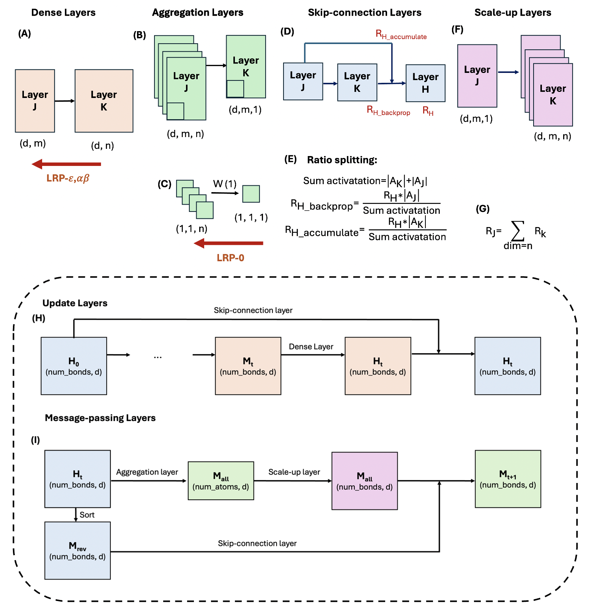

# lrp_chemprop
Hi, this repository demonstrates my work for my Master's Thesis. The project aims to investigate the optimal training setting for an explainable chemprop model using Layer-wise Relevance Propagation (LRP). This repository contains all the code that use to implement LRP and construct the evaluation framework.

  

